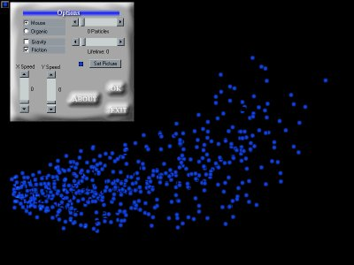



## Particle Benchmark\(UPDATE\)

### Description

So you think your new PIII is fast? well test it on this particle benchmarker. And enjoy the show while you're at it. (Now accually benchmarks your system)
 
### More Info
 

             |
---                |---
**Submitted On**   |2000-03-28 01:08:00
**By**             |[Michael Pote](https://github.com/Planet-Source-Code/PSCIndex/blob/master/ByAuthor/michael-pote.md)
**Level**          |Intermediate
**User Rating**    |4.3 (17 globes from 4 users)
**Compatibility**  |VB 4\.0 \(32\-bit\), VB 5\.0, VB 6\.0
**Category**       |[Miscellaneous](https://github.com/Planet-Source-Code/PSCIndex/blob/master/ByCategory/miscellaneous__1-1.md)
**World**          |[Visual Basic](https://github.com/Planet-Source-Code/PSCIndex/blob/master/ByWorld/visual-basic.md)
**Archive File**   |[CODE\_UPLOAD43463272000\.zip](https://github.com/Planet-Source-Code/michael-pote-particle-benchmark-update__1-6814/archive/master.zip)

